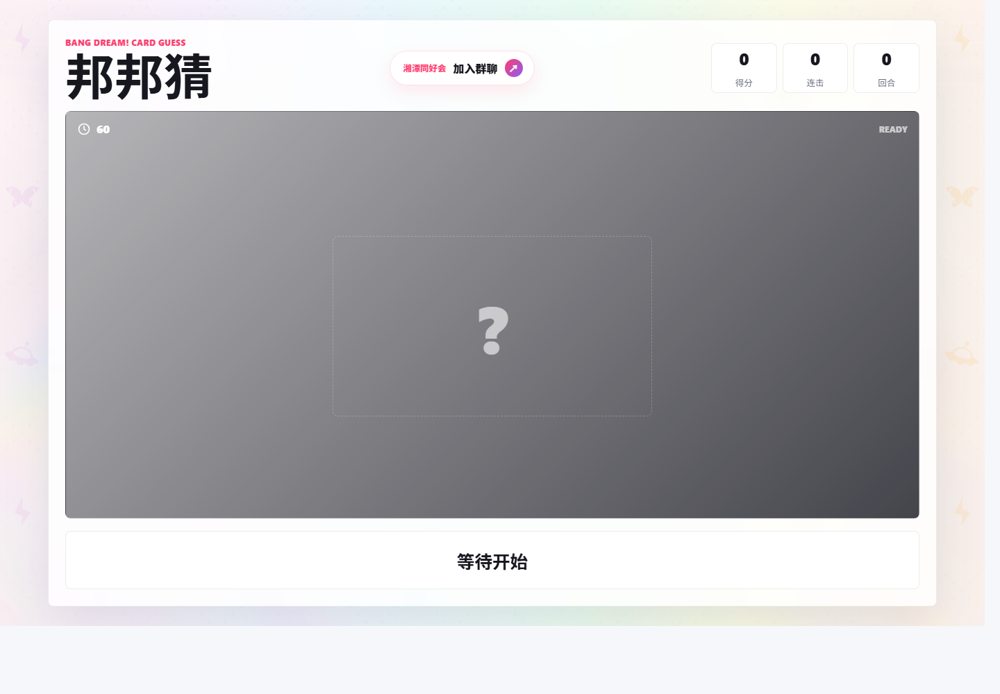
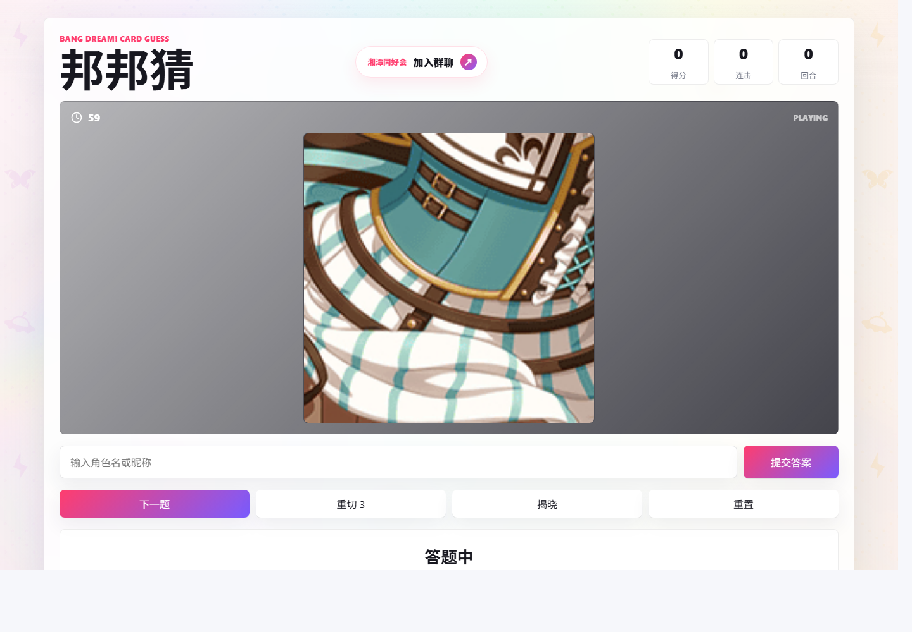

# BanG Dream! Card Guess

<p align="center">
  
</p>

<p align="center">
  <a href="https://space.bilibili.com/3546647883680530"></a>
  
  
</p>

> BanG Dream! 卡面猜图互动 Web 游戏。支持线下摊位主持模式、单人自玩模式、本地卡面缓存、智能正方形裁剪、玩家屏幕与主持控制台 WebSocket 同步。
>
> **线上体验地址**: [http://xtbang.top/](http://xtbang.top/)

---

## 目录

- [项目简介](#项目简介)
- [界面预览](#界面预览)
- [游戏模式](#游戏模式)
- [页面入口](#页面入口)
- [快速开始](#快速开始)
- [环境变量](#环境变量)
- [默认配置](#默认配置)
- [主持鉴权](#主持鉴权)
- [卡面缓存](#卡面缓存)
- [人脸检测与裁剪](#人脸检测与裁剪)
- [二维码与离线](#二维码与离线)
- [现场部署](#现场部署)
- [音符射手](#音符射手)
- [资源来源](#资源来源)
- [目录结构](#目录结构)
- [常见问题](#常见问题)

---

## 项目简介

**BanG Dream! Card Guess** 是从 Koishi 机器人猜卡插件改造的本地 Web 游戏，面向线下摊位互动场景：玩家只看裁剪后的卡面局部，主持人在控制台判定角色名是否正确；揭晓时完整展示卡面并用红框标出裁剪位置。

**核心功能：**

- 摊位主持模式 + 单人自玩模式
- WebSocket 实时同步玩家页、主持页、设置页
- 智能裁剪算法，优先选择细节丰富区域
- YOLO 动漫人脸预检测，支持避开/优先/只切人脸三种策略
- 双队互动、计分系统、倒计时、连击、自动下一题
- 按乐队/稀有度/属性/卡面版本筛选卡池，内置去重
- PWA 离线缓存基础页面，卡面可提前缓存至本地完全离线
- 接入开源音符射手，等待玩家可扫码游玩
- 二维码页（自动检测局域网 IP）+ 本地成绩榜
- 设置页支持导入/导出配置、运行状态实时检查

---

## 界面预览

### 玩家屏幕

<p align="center">
  
</p>

### 自己玩模式

<p align="center">
  
</p>

---

## 游戏模式

### 摊位模式

适合线下活动。玩家只看 `/player` 页面，主持人使用 `/host` 控制题目。

1. 主持点击「开始/下一题」
2. 玩家看局部图，说出角色名
3. 主持根据回答点击「答对 / 答错 / 跳过」
4. 页面揭晓完整卡面，红框标出裁剪位置
5. 进入下一题

主持快捷键：

| 按键 | 功能 |
| --- | --- |
| `Space` / `→` | 开始/下一题 |
| `R` | 重切 |
| `V` | 揭晓 |
| `Enter` | 答对 |
| `Backspace` | 答错 |
| `S` | 跳过 |
| `U` | 撤销判定 |
| `1` / `2` | 切换 A/B 队 |

### 自己玩模式

使用 `/solo` 页面，不需要主持登录。玩家输入答案，系统根据昵称表自动判定。

---

## 页面入口

| 页面 | 地址 | 说明 |
| --- | --- | --- |
| 玩家页 | `/player` | 给玩家或展示屏幕使用 |
| 自玩页 | `/solo` | 自己玩模式，输入答案自动判定 |
| 主持页 | `/host` | 控制题目与判定（需登录） |
| 设置页 | `/settings` | 调整规则与模式（需登录） |
| 登录页 | `/login` | 主持登录入口 |
| 二维码页 | `/qr` | 打印各页面入口和 Wi-Fi 二维码 |
| 音符射手 | `/note-shooter` | 等待时游玩开源音符射击小游戏 |
| 成绩榜 | `/scores` | 查看本地小游戏排行榜 |

---

## 快速开始

### 环境要求

- Node.js 18+（推荐 20 LTS）
- Python 3.9+（仅人脸预检测时需要）

### 安装与启动

```sh
# 安装依赖
npm install

# 可选：提前缓存卡面（推荐现场前执行）
npm run cache-cards

# 可选：更新人脸框数据库
pip install ultralytics
npm run detect-faces

# 启动摊位模式
npm run booth

# 或启动自己玩模式
npm run solo
```

### 一键脚本

Windows：

```bat
scripts\install-env.cmd       # 首次安装环境
scripts\start-booth.cmd        # 启动摊位模式
scripts\start-solo.cmd         # 启动自己玩模式
scripts\stop-server.cmd        # 关闭服务
```

macOS / Ubuntu：

```sh
chmod +x scripts/*.sh
./scripts/install-env.sh
./scripts/start-booth.sh
./scripts/start-solo.sh
./scripts/stop-server.sh
```

修改端口（默认 `5173`）：

```sh
PORT=5180 npm run booth
```

---

## 环境变量

| 变量 | 默认值 | 说明 |
| --- | --- | --- |
| `HOST_PASSWORD` | 随机生成 | 主持登录密码，启动时打印。公网部署必须手动设置 |
| `PORT` | `5173` | HTTP 服务端口 |
| `APP_MODE` | `booth` | 设为 `solo` 强制进入自己玩模式 |
| `DATA_DIR` | `./data` | 数据文件存储目录 |

---

## 默认配置

首次启动时的默认值（所有配置均可在 `/settings` 页面修改并持久化到 `data/settings.json`）。

| 配置项 | 默认值 | 说明 |
| --- | --- | --- |
| 主持密码 | 随机生成 | 未设置 `HOST_PASSWORD` 时自动生成，启动时打印到终端 |
| 难度 | `normal` | 简单 / 普通 / 困难 |
| 人脸策略 | `auto` | 跟随难度：简单优先人脸，普通不限制，困难避开人脸 |
| 裁剪尺寸 | `180` px | 正方形裁剪边长 |
| 智能候选数 | `120` | 每题评估的候选裁剪区域数 |
| 最大重切 | `3` | 每题可重切次数 |
| 每题秒数 | `60` | 倒计时 |
| 答对加分 | `1` | 基础得分 |
| 答错扣分 | `0` | 默认不扣分 |
| 卡面去重窗口 | `20` | 最近 20 张尽量不重复 |
| 角色去重窗口 | `8` | 最近 8 个角色尽量不重复 |
| 乐队筛选 | 全部 | 8 支角色组 |
| 稀有度筛选 | 1~5 | 全部稀有度 |
| 属性筛选 | 全部 | cool / happy / powerful / pure |
| 卡面版本 | `mixed` | 训练前/训练后随机 |

### 难度预设

| 难度 | 裁剪尺寸 | 智能候选数 | 适用场景 |
| --- | --- | --- | --- |
| 简单 | `230` | `90` | 新玩家、暖场 |
| 普通 | `180` | `120` | 默认 |
| 困难 | `130` | `170` | 挑战局 |

---

## 主持鉴权

`/host` 和 `/settings` 需要密码登录。登录成功后获取 Cookie（有效期 1 天），重启服务后需重新登录。

未设置 `HOST_PASSWORD` 时，服务端会自动生成一个随机密码并打印到终端。**公网部署务必手动设置强密码：**

```sh
# 命令行直接启动
HOST_PASSWORD="你的密码" npm run booth

# 配合一键脚本
# Windows:  $env:HOST_PASSWORD="你的密码"; scripts\start-booth.cmd
# macOS:    HOST_PASSWORD="你的密码" ./scripts/start-booth.sh
```

自己玩模式 `/solo` 不需要登录。

---

## 卡面缓存

```sh
npm run cache-cards    # 卡面保存到 public/cards/
```

运行游戏时优先读取本地缓存，缺失时才联网下载。该目录可能占用数 GB。

---

## 人脸检测与裁剪

### 人脸预检测

项目自带 YOLO 权重 `weight/best.pt` 和人脸框数据库 `data/face-boxes.json`，普通使用无需重新检测。

```sh
pip install ultralytics
npm run detect-faces                          # 增量检测
python scripts/detect-faces.py --force        # 强制全量重跑
```

### 人脸策略

| 策略 | 说明 |
| --- | --- |
| 跟随难度 | 默认。简单优先人脸，普通不限制，困难避开人脸 |
| 不限制 | 仅使用智能裁剪评分 |
| 避开人脸 | 脸部区域越多分数越低 |
| 优先人脸 | 人脸区域加分 |
| 只切人脸 | 仅选择覆盖脸部的区域 |

### 智能裁剪算法

服务端（Jimp）完成：随机生成候选点 → 评估色彩方差、边缘密度 → 淘汰纯色背景 → 按分排序选细节最丰富区域。重切时要求新位置与历史位置保持距离。

---

## 二维码与离线

### `/qr` 二维码页

自动检测局域网 IP 生成入口二维码。摊位模式生成玩家页、主持登录、设置页、音符射手和 Wi-Fi 二维码；自己玩模式生成自玩页和入口总览。

> Wi-Fi 二维码只连接网络，不自动打开网页。建议打印两个码：一个连线，一个扫码打开页面。

### PWA 离线

`public/sw.js` 缓存基础页面、CSS、JS、背景图。卡面离线依赖 `public/cards/` 提前缓存。

---

## 现场部署

1. 笔记本运行启动脚本
2. 平板、手机、玩家屏幕连同一 Wi-Fi 或热点
3. 打开 `/qr` 确认二维码使用局域网 IP（非 `127.0.0.1`）
4. 玩家扫码进入 `/player`，等待的玩家进入 `/note-shooter`
5. 主持登录 `/login` 后进入 `/host`

**检查清单：** 缓存卡面 → 检查 `/settings` 卡池数量 → 确认二维码局域网地址 → 测试玩家连接数 → 确认主持密码已设置

---

## 音符射手

`/note-shooter`（旧入口 `/queue` 兼容）接入 [zfkdiyi/bangdream](https://github.com/zfkdiyi/bangdream) 开源音符射手。玩家选择难度后移动鼠标/手指控制角色，按住屏幕发射音符。成绩写入 `data/note-shooter-scores.json`。素材已内置，局域网离线可用。

成绩榜 `/scores` 实时展示本地排行榜，支持单条删除（需主持密码）。

---

## 资源来源

| 资源 | 来源 |
| --- | --- |
| 原 Koishi 插件 | [xsjh/koishi-plugin-bangbangcai](https://github.com/xsjh/koishi-plugin-bangbangcai) |
| 卡面 | 运行时从 Bestdori 缓存 |
| 题库 & 昵称 | 原 Koishi 插件整理 |
| 人脸检测权重 | 项目自带 `weight/best.pt` |
| 音符射手 | [zfkdiyi/bangdream](https://github.com/zfkdiyi/bangdream) |

> BanG Dream! 相关素材版权归对应权利方所有。本项目仅供同好交流、线下互动与非商业展示。

---

## 目录结构

```
├── server.mjs                   # HTTP + WebSocket 服务端
├── vite.config.mjs              # Vite 构建配置
├── index.html                   # HTML 入口
├── data/                        # 运行时数据（设置、人脸框、成绩）
├── public/                      # 静态资源（背景、卡片缓存、PWA）
├── resource/                    # 题库 (all5_2.json) 与昵称 (nickname.json)
├── scripts/                     # 安装、启动、部署脚本
├── weight/                      # YOLO 人脸检测权重
├── src/web/                     # 前端源码
└── screenshots/                 # 截图
```

---

## 常见问题

**Q: 现场没有公网能玩吗？**
A: 可以。提前 `npm run cache-cards`，题目和卡面都在本地，只需局域网。

**Q: 主持页怎么防止玩家误入？**
A: `/host` 和 `/settings` 需密码登录。通过 `HOST_PASSWORD` 环境变量设置密码。

**Q: PWA 离线是完全不需要网络吗？**
A: 基础页面和背景可离线缓存；卡面取决于 `public/cards/` 是否提前缓存完整。

**Q: 设置避开人脸还是偶尔切到脸？**
A: 确认 `/settings` 运行状态里人脸框数据不为 0。极端侧脸、遮挡脸可能漏检，配合「重切」处理。

**Q: 裁出来的图都是纯色背景？**
A: 增大「智能候选数」或减小「裁剪尺寸」，给算法更多选择。

**Q: 更新代码后缓存卡面需要重下吗？**
A: 一般不需要。只有题库新增卡面时才需重新执行 `npm run cache-cards`。

**Q: 怎么部署到服务器？**
A: 使用 `scripts/deploy-now.mjs` 通过 rsync + ssh 同步，服务器用 pm2 管理进程。

---

> 欢迎加入湘潭 BanG Dream! 同好会：[点击链接加入群聊](https://qm.qq.com/q/6ytGE7qIWQ)
